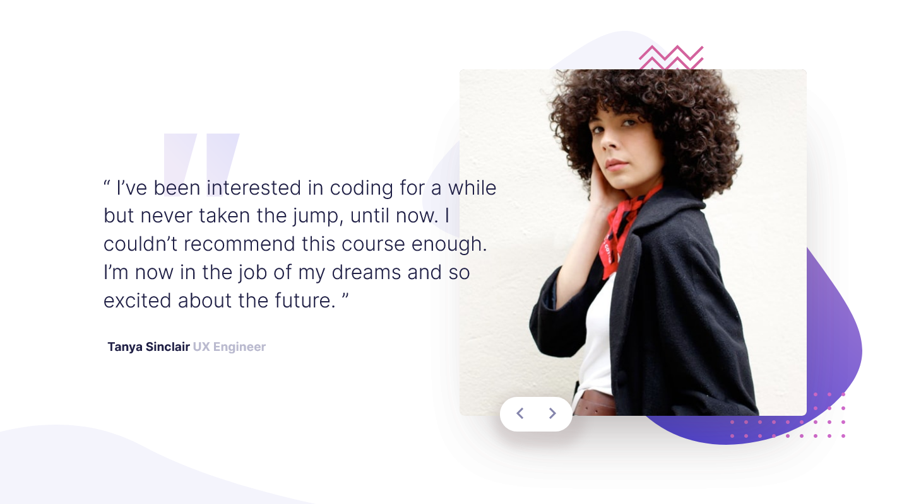

#Frontend Mentor - Coding bootcamp testimonials slider solution

## Table of contents

## 🎨 Layout

 
### The challenge

Users should be able to:

- View the optimal layout for the site depending on their device's screen size
- See hover states for all interactive elements on the page

### Screenshot

### Links

- Solution URL: [Github](https://github.com/wandersondefariasprogramador)

## My process

### Ajustes e melhorias

O Projeto foi desenvolvido com as Tecnologia e voltadas nas seguintes Tarefas:

- [x] Criação do HTML
- [x] Criação do CSS
- [x] Criação do javascript
- [X] Criação SCSS
- [X] Criação Desktop-first workflow
- [X] Criação Gallery
- [X] Flexbox Criação

## 🤝 Author

Agradecemos às seguintes pessoas que contribuíram para este projeto:

<table>
  <tr>
       <td align="center">
      <a href="#">
         
        
          <b>wanderson de farias</b>
        
      </a>
    </td>
    <a href="https://github.com/wandersondefariasprogramador" >LINK-GITHUB</a>

  </tr>
</table>
 check application <a href="https://wandersondefariasprogramador.github.io/Landing-page-Lamborghini/">HERE!</a>

